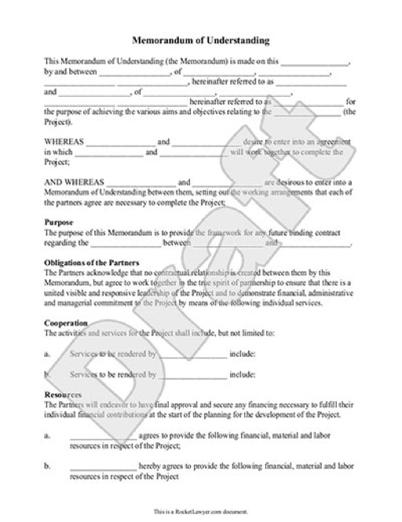
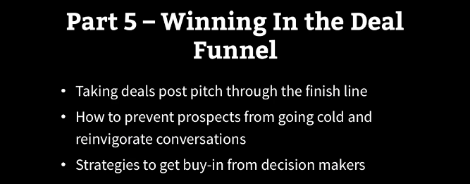

# HOW TO GET A BUSINESS DEVELOPMENT JOB

_By [Jeremy Schifeling](https://www.breakinto.tech/)._

***

## **STEP 1: WHAT ARE BUSINESS DEVELOPMENT JOBS ALL ABOUT?**

Memorandum of Understanding (MOU)

* **AKA**: BD, BizDev
* **Overview**: BD is like sales without money. You work with other companies to form partnerships - but instead of closing a paid deal, the companies barter something valuable to each of them. For instance, early in Google’s existence, it did a BD deal with Yahoo! that made it the default search engine. In exchange for getting access to Yahoo’s millions of users, Google made Yahoo more effective for its customers.
* **Example project**: Partner with HBO to make sure that its original programming is available on the Apple TV at launch.
* **What you do all day**: Explore opportunities, build relationships, propose/close deals
* **Roles**: Business Development Manager/Representative
What they look for: Candidates with strong interpersonal and negotiation skills
* **Example job**: [Relationship Manager - Business Development, Apple Pay](http://www.awesomescreenshot.com/image/883029/5bc2e169dc20ecbd9195d94782dcafb8)

## **STEP 2: WOULD YOU BE A GOOD FIT FOR BUSINESS DEVELOPMENT?**

Ask yourself if you'd love doing these kinds of things all day:

* Exploring the landscape of potential partners
* Building relationships
* Proposing partnerships that provide mutual value
* Negotiating and finalizing deals
* Managing relationships and deal implementation

If your answer is "Yes" to the majority of activities, you'd likely be a good fit for BizDev jobs.

## **WHAT SKILLS DO YOU NEED FOR BUSINESS DEVELOPMENT JOBS?**

For each major activity, I've listed the most common keywords from across dozens of job descriptions, as well as a sample resume bullet:

For each major activity, I've listed the most common keywords from across dozens of job descriptions, as well as a sample resume bullet:
* **Exploring the landscape of potential partners**
  - _Keywords_: identify partnership opportunities, prioritize partners, strategic analysis, partner with product and sales teams, evaluate opportunities, competitive landscape
  - _Sample Bullet_: Conducted a competitive analysis of used car marketplace to identify weakness in the Midwestern market; led to partnership with the Midwest Dealers Association to remedy lack of inventory
* **Building relationships**
  - _Keywords_: relationship-building skills, source, cultivate, and qualify opportunities, develop pipeline, working with executives, maintain relationships, provide thought leadership in the space
  - _Sample Bullet_: Hosted popular event at annual developer's conference, generating 27 partnership leads
* **Proposing partnerships that provide mutual value**
  - _Keywords_: write partnership specifications, structure partnerships, build frameworks, strategic partnerships, joint ventures, acquisitions, investments
  - _Sample Bullet_: Structured partnership deal with main competitor to accelerate the growth of our sector without giving up competitive advantage
* **Negotiating and finalizing deals**
  - _Keywords_: negotiate partnership terms, draft term sheets, deal acceleration, close deals, deal structures, remove roadblocks, secure buy-in
  - _Sample Bullet_: Negotiated deal with Google that drove 100K new visits per month
* **Managing relationships and deal implementation**
  - _Keywords_: deal execution, manage established partnerships, prevent churn, get partner feedback, monitor deal performance
  - _Sample Bullet_: Successfully managed deal with City of San Francisco, ensuring renewal after first two-year contract

## **STEP 4: WHAT BUSINESS DEVELOPMENT TRAINING DO YOU RECOMMEND?**

If you want to brush up on any of these skills, check out Scott Britton's [Business Development for Startups and Tech Companies](http://click.linksynergy.com/fs-bin/click?id=62sJzUm1CLs&subid=&offerid=323058.1&type=10&tmpid=14538&RD_PARM1=https%3A%2F%2Fwww.udemy.com%2Fbusiness-development-strategy-startups%2F) course on Udemy. I like two things about this course in particular:

1. It's comprehensive. It covers everything from high-level BizDev strategy all the way down to the nuts-and-bolts of how to find the exact right partner's email address.
 
2. And it's also step-by-step. Scott literally walks you through every part of the relationship-building process in a way that lots of other people would just gloss over ("So I connected with this guy and then we did a deal...")

## **STEP 5: HOW DO YOU ACTUALLY GET A BUSINESS DEVELOPMENT JOB?**

To help you convert your passion and skills into an actual job, I've put together [a step-by-step course](http://courses.breakinto.tech/courses/land) that covers how to:

* Design a resume that will mark you as an insider to tech recruiters
* Make sure you find every single great tech job across multiple sites
* Get a referral at just about any tech company - even if you don't know anyone directly
* Prepare for every kind of tech interview question with point-by-point formulas