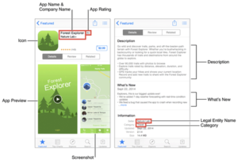

# HOW TO GET A PRODUCT MANAGEMENT JOB

_By [Jeremy Schifeling](https://www.breakinto.tech/)._

***

## **STEP 1: WHAT'S PRODUCT MANAGEMENT ALL ABOUT?**

Example: Product Specs

* **Overview**: Product Management leads the development of new products. Given that tech companies are often organized around products (what would Facebook be without, well, Facebook?), this is often the most important role within the company.
* **AKA**: PM
* **Example project**: Take a new app from vision to shipping.
* **What you do all day**: Learn about your audience, develop new concepts, create product blueprints, manage a cross-functional team to bring the product to life, review metrics
* **Roles**: Associate Product Manager (more junior), Product Manager (more senior)
* **What they look for**: People with technical backgrounds (since you’ll work so closely with engineers) and leaderships skills (since you’ll be responsible for coordinating a cross-functional team)
* **Sample job**: [Product Manager, Zenefits](http://www.awesomescreenshot.com/image/883006/a8754dd6ad9093e20669ab4dc08ed871)

## **STEP 2: WOULD YOU BE A GOOD FIT FOR PRODUCT MANAGEMENT?**

Ask yourself if you'd love doing these kinds of things all day:

* Learning about current and prospective customers
* Developing a vision for a new product based on customer needs
* Translating that vision into detailed specifications to be built out
* Motivating cross-functional partners (engineers, designers) to solve challenges and ship your product on-time
* Evaluating key metrics to share with execs and optimize performance

If your answer is "Yes" to the majority of activities, you'd likely be a good fit for PM.

## **STEP 3: WHAT SKILLS DO YOU NEED FOR PM?**

For each major activity, I've listed the most common keywords from across dozens of job descriptions, as well as a sample resume bullet:

* **Learning about current and prospective customers**
  - _Keywords_: usability studies, research, market analysis, competitive position, pain points, personas
  - _Sample Bullet_: Conducted usability study with inactive users to identify the top 3 reasons they'd stopped engaging with the site
* **Developing a vision for a new product based on customer needs**
  - _Keywords_: ideation, product vision, roadmap, product lifecycle, value proposition
  - _Sample Bullet_: Set the vision for a new photo sharing app, from high-level concept to roadmap and milestones
* **Translating that vision into detailed specifications to be built out**
  - _Keywords_: product requirements, specifications, user interfaces, wire frames, mock ups, release plans, go-to-market, user stories, prototypes, test plans, release checklists
  - _Sample Bullet_: Built out detailed product specifications for viral sharing feature, leading to a ship date one month earlier than expected
* **Motivating cross-functional partners (engineers, designers) to solve challenges and ship your product on-time**
  - _Keywords_: collaborate, daily workflow, leadership, shared vision, consensus, engineers, designers, ship on time and within budget, milestones
  - _Sample Bullet_: Led daily standups with engineering and design team to overcome roadblocks, achieving 90% feature functionality after just three months of development
* **Evaluating key metrics to share with execs and optimize performance**
  - _Keywords_: metrics, dashboard, SQL, A/B test, presentation, senior leadership
  - _Sample Bullet_: Ran A/B test to determine the most effective onboarding flows, increasing new user sign-ups 75% month over mont

## **STEP 4: DO YOU NEED ADDITIONAL TRAINING TO GET A PM JOB?**

This mostly depends on two things:

* Are you an engineer by training?
* Do you already work for a tech company?

If you answered "Yes" to either of these questions, you can likely become a Product Manager without additional training.

For instance, if you're an engineer, tech companies will assume that you'll be able to communicate with and command the respect of fellow engineers. And so they'll often give you the benefit of the doubt.

And if you already work at a tech company, it's much easier to transfer internally into Product Management than to try to break in from the outside since you're already a known quantity.

Whereas, if you're neither technically-trained nor working in tech, you'll likely have a hard time breaking into Product Management directly without help. The role is just too in-demand (everyone wants to be the leader!) and too infrequently hired for (a typical company may have one PM for every 20 engineers). And so you'll need to both train up and work hard to break on through.

## **STEP 5: WHAT PM TRAINING PROGRAMS ARE OUT THERE?**

Product Management interviews usually focus on your experience designing and building products. And for this reason, I'm not a big fan of classroom-based, theoretical approaches to learning Product Management. After all, even if you come out of one of these programs knowing how to be a PM, you'll still need to prove it in the interview room. And the best way to do that is to take a course that helps you build out a portfolio of actual product plans.

As such, the action-based course that I particularly recommend is [One Week PM](https://www.oneweekpm.com/?affcode=43087_0-dy_gtr).

## **STEP 6: WHAT'S ONE WEEK PM LIKE?**

[One Week PM](https://www.oneweekpm.com/?affcode=43087_0-dy_gtr) is an online course created by Kevin Lee, a former PM at AltSchool and Kabam - two of the Bay Area's hottest startups (having raised a combined $400M!).

But what I admire the most about Kevin is how hard he hustled to land those jobs. Because he actually started his career in finance - i.e., about as far away from tech as you get. And yet, he figured out how to crack the code not just on this tricky industry, but on the absolute sexiest job within it.

And so if you're going to have anyone teach you how to break into Product Management, who better to do so than the person who made the biggest leap to get into this role?

That said, having taken Kevin's course myself, I'm also really impressed with his teaching chops. There are probably a dozen courses where you can watch techies drone on about the benefits of one coding language or another - all the while getting no closer to your goal of becoming a PM. But Kevin's lessons are tight, focused on only what matters most (it's not 27 Week PM, after all!), and, most importantly, super actionable.

As mentioned in the last section, you won't just watch a bunch of boring videos and then having nothing to show for it. Instead, you'll actually build out a whole product plan - from user testing to roadmap - which will be Exhibit A when it comes time to interview for this role. Because seeing is believing for PM hiring - and One Week PM will give your prospective employer reason to believe!

