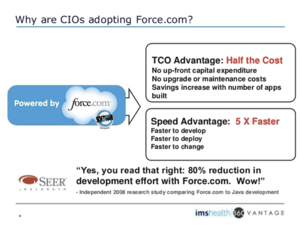
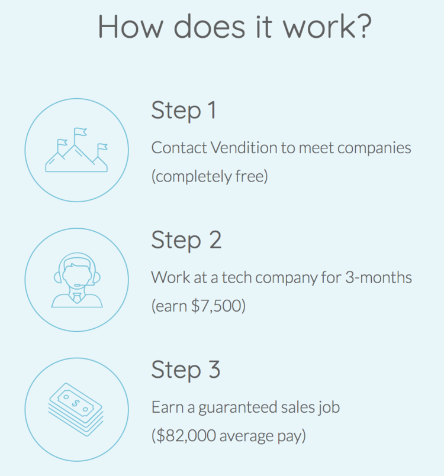

# HOW TO GET A TECH SALES JOB

_By [Jeremy Schifeling](https://www.breakinto.tech/)._

***

## **STEP 1: WHAT'S SALES ALL ABOUT?**

Example: Product Specs

* **Overview**: For complex, expensive products, a Sales team can close deals that wouldn’t be feasible online. This includes both B2B (e.g., Salesforce sells a $10MM package to IBM) and B2C businesses (e.g., Facebook sells a seven-figure ad deal to Ford).
* **Example project**: Sell $2MM in Salesforce subscriptions by the end of the fiscal year.
* **What you do all day**: Research opportunities, talk with prospects or customers, give demos, and close deals
* **Roles**: Sales Development/Inside Sales (generating new opportunities by emailing and calling), Account Executive/Field Sales (closing deals, often at the customer’s site), Account Manager (upselling existing clients)
* **What they look for**: Candidates with a track record of results and incredible powers of persuasion
* **Sample job**: [Account Executive, Salesforce](http://www.awesomescreenshot.com/image/883024/541502877137c2c0fd8a98c90d36ddbe)

## **STEP 2: WOULD YOU BE A GOOD FIT FOR SALES?**

Ask yourself if you'd love doing these kinds of things all day:

* Leveraging market data to identify potential customers
* Cold-calling/emailing these prospects
* Making persuasive presentations
* Negotiating and finalizing deals
* Managing relationships and upselling

If your answer is "Yes" to the majority of activities, you'd likely be a good fit for sales.

## **STEP 3: WHAT SKILLS DO YOU NEED FOR SALES?**

For each major activity, I've listed the most common keywords from across dozens of job descriptions, as well as a sample resume bullet:

For each major activity, I've listed the most common keywords from across dozens of job descriptions, as well as a sample resume bullet:
* **Leveraging market data to identify potential customers**
  - _Keywords_: CRM, Salesforce, account strategy, sales plan, territory planning, uncover opportunities
  - _Sample Bullet_: Devised a new sales plan to target the SMB segment, generating $2M in incremental sales within the first year
* **Cold-calling/emailing these prospects**
  - _Keywords_: lead generation, lead pipeline, prospecting, cold call, inbound leads
  - _Sample Bullet_: Implemented sales development processes that doubled pipeline value in six months
* **Making persuasive presentations**
  - _Keywords_: value-based sales, product demos, events, unmet customer needs
  - _Sample Bullet_: Managed presence at all industry events, producing $5M in sales through that channel alone
* **Negotiating and finalizing deals**
  - _Keywords_: contract generation, closing, sales goals, quota, revenue targets
  - _Sample Bullet_: Outperformed quota 24 months in a row, earning two consecutive invites to the President's Club
* **Managing relationships and upselling**
  - _Keywords_: account success, training, enablement, strategic business plans, consultative sales, customer relationships, onboard new customers
  - _Sample Bullet_: Leveraged relationships with existing clients to drive $300K in pure upsell busines

## **STEP 4: DO YOU NEED ADDITIONAL TRAINING TO GET A SALES JOB?**

Sales is a true "seeing is believing" profession. If you can pitch me on yourself in an interview, I have no reason to believe you couldn't do the same for a prospective client.

As such, if you're the kind of person who feels prepared to walk into an interview and persuade anyone to buy anything, no further training is necessary. There are [thousands of junior sales roles open on any given day in Silicon Valley](https://www.indeed.com/jobs?q=sales+development+representative&l=San+Francisco,+CA&radius=100) - to say nothing of the rest of the world. So just get out there and give them reason to believe!

Whereas, if you feel like you could use some practice making a pitch and handling objections, the training programs below can get you up to speed ASAP.

## **STEP 5: WHAT SALES TRAINING PROGRAMS ARE OUT THERE?**

There’s no better way to learn sales than to do sales. The courage to pick up the phone, talk to a prospect, and close a deal is best powered by muscle memory, not by having read about someone else doing it.

As such, I highly recommend a sales training program that’s based on a real-world apprenticeship: [Vendition](https://courses.salesbootcamp.com/p/sdr/?affcode=110399_cllrk9b-).

## **STEP 6: WHAT'S VENDITION LIKE?**

There are three things I love about Vendition’s approach to sales training:

1. You get to work in tech sales immediately. No dropping two years and $100K on a theory-focused MBA - you get to learn sales as you do sales.
2. Vendition bears all the risk. Unlike bootcamps that charge you for the chance of getting a tech job, Vendition pays you $7,500 for the 3-month apprenticeship and you owe nothing if you decide not to pursue a sales career.
3. You can participate almost anywhere. Because Vendition’s training is online and their partner companies are all over, you don’t have to move to pricey San Francisco and live in a closet to get access to a tech career!

The best way to see if Vendition is right for you is to [try their free 1-week training](https://courses.salesbootcamp.com/p/sdr/?affcode=110399_cllrk9b-). That way, you can get a taste of their action-based teaching style before taking the plunge.

